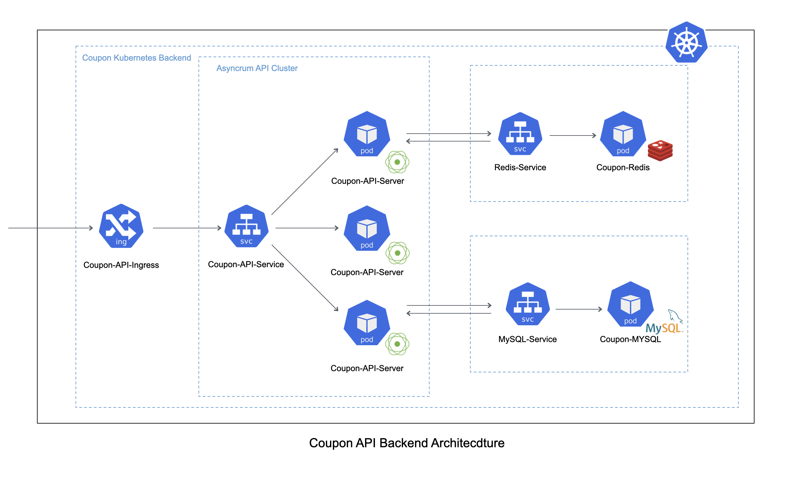
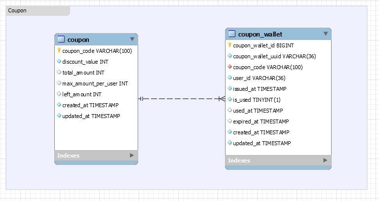
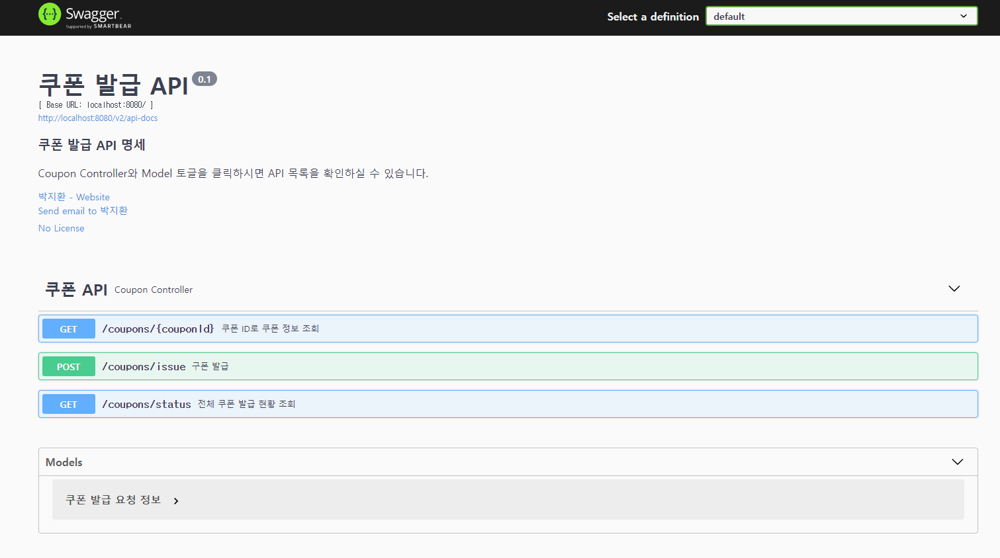
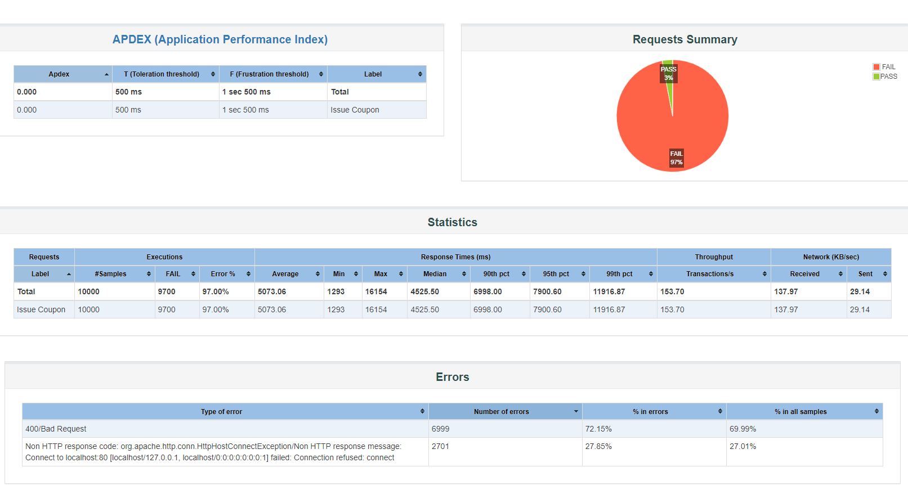

# 쿠폰 이벤트 API 백엔드

## 목차

- [1. 프로젝트 개요](#1-프로젝트-개요)
  - [1-1. 프로젝트 소개](#1-1-프로젝트-소개)
  - [1-2. 구동 가이드](#1-2-구동-가이드)
  - [1-3. 문제 해결 전략](#1-3-문제-해결-전략)
  - [1-4. 기술 스택](#1-4-기술-스택)
- [2. 개발 결과물](#2-개발-결과물)
  - [2-1. 백엔드 아키텍처](#2-1-백엔드-아키텍처)
  - [2-2. 데이터베이스 ERD](#2-2-데이터베이스-erd)
  - [2-3. API 문서화](#2-3-api-문서화)
  - [2-4. 부하 테스트](#2-4-부하-테스트)
- [3. 개선 사항](#3-개선-사항)
  - [3-1. 백엔드 아키텍처](#3-1-백엔드-아키텍처)
  - [3-2. API 서버 개발](#3-2-api-서버-개발)
  - [3-3. 테스트 코드](#3-3-테스트-코드)

## 1. 프로젝트 개요

### 1-1. 프로젝트 소개

선착순 쿠폰 발급 이벤트를 위한 백엔드 시스템입니다.
이 프로젝트는 분산 시스템 시리즈의 첫번째 프로젝트입니다.

- 프로젝트의 요구사항은 아래와 같습니다:

```bash
쿠폰 발급 이벤트를 진행합니다.
사용자는 다음과 같은 종류의 쿠폰을 발급 받을 수 있습니다.

  - 쿠폰 A: 1만원 할인, 선착순 300장, 쿠폰코드: A0001
  - 쿠폰 B: 5천원 할인, 선착순 2000장, 쿠폰코드: B0001
  - 쿠폰 C: 1천원 할인, 천착순 10000만, 쿠폰코드: C0001

사용자는 선착순으로 발급 받을 수 있으며, 중복으로 발급 받을 수 없습니다.
```

- 시스템의 핵심 아이디어만을 보여주기 위해 다음과 같은 가정을 합니다:

```bash
- MSA 아키텍처라고 가정합니다. 따라서 사용자 인증/인가 등의 추가 컴포넌트는 포함되지 않습니다.
- 쿠폰의 정보는 미리 데이터베이스에 들어가 있다고 가정합니다.
```

### 1-2. 구동 가이드

- 구동을 위해 필요한 것들: `Docker`, `Kubernetes(K8s), Minikube`, `Java`

```bash
# 1. GitHub 복제
git clone https://github.com/krapie/coupon-event-backend.git

# 2. 레포지토리로 디렉토리 변경
cd coupon-event-api-backend

# 3. minikube 구동
minikube start

# 4. minikbue ingress 에드온 활성화
minikube addons enable ingress

# 5. 로컬 연결을 위해 minikube tunneling 시작
minikube tunnel

# 6. coupon 네임스페이스 생성 및 컨텍스트 스위치
kubectl create namespace coupon
# kubectl config set-context --current --namespace coupon

# 7. 쿠폰 백엔드 시스템의 k8s 메니페스트 파일 배포
kubectl apply -f minikube --recursive

# 8. Redis Pod ID 확인
kubectl get pods -l app=coupon-redis

# 9. K8s의 Redis Pod에 접속
kubectl exec -it ${REDIS_POD_ID} -- redis-cli

# 10. (Temp) Redis에 쿠폰 이벤트 카운트 값 세팅
set A0001:count 0
set B0001:count 0
set C0001:count 0

# 11. 웹브라우저에서 Swagger API 문서로 접속
curl http://localhost/swagger-ui/

# 12. JMeter 등으로 쿠폰 발급 API 부하 테스트 (Jmeter 루트 디렉토리에서 수행)
./bin/jmeter -n -t ${path-to-coupon-event-backend}/coupon-api-load-test.jmx -l test.result -e -o ${path-to-coupon-event-backend}/jmeter-result

# 13. JMeter 부하 테스트 결과 확인
cd jmeter-result
open index.html
```

### 1-3. 문제 해결 전략

먼저 쿠폰 발급 이벤트라는 도메인의 특성을 파악해야 합니다.

1. 쿠폰 발급 이벤트를 진행하는 **짧은 시간**에 **막대한 트래픽**이 서버에 가해짐
2. **짧은 시간** 안에 발생하는 **수많은 트랜잭션**에서 쿠폰 제한 수량과 같은
   **데이터의 정확성과 일관성 (무결성)**을 지켜야 함,

이러한 쿠폰 발급 도메인의 특성을 고려하여,
**분산 시스템을 기반으로 한 대규모 백엔드 시스템**으로 시스템을 구성하였습니다.

1. 수많은 트래픽을 감당하기 위해 서버들은 수평적인 확장이 가능해야 하기 때문에,
   **무상태 API 서버**로 개발하였습니다. 또한 짧을 시간에 막대한 트래픽이 서버에 가해지기 때문에,
   오토 스케일링이 아닌, 이벤트 시작 전에 **많은 서버를 미리 올려 놓는 형태**로 진행해야 합니다.
   이벤트 시 사용하게 될 수 많은 서버들을 관리하기 위해 K8s를 사용하였습니다.
2. **데이터의 무결성**을 지키기 위해서는 동시성 제어를 수행해야 합니다.
   먼저 데이터베이스 자체의 Lock을 고려해 볼 수 있지만, 짧은 시간 안에 수 많은 트랜잭션을
   처리해야 하기 때문에, 이 보다 빠른 **캐시**(Cache)를 이용하여 **Lock**을 거는 방식을선택하였고,
   분산 시스템의 성격에 맞춰 캐시의 **Distributed Lock**을 사용하였습니다.

이러한 시스템의 특성을 고려하여 아래의 기술들을 적용하였습니다.

1. API 서버는 많은 쓰레드를 사용하면서 Sync/Blocking I/O인 기존의 Spring MVC 프레임워크보다는,
   **Async/Non-Blocking I/O**이며 적은 쓰레드로 운용되는 **Spring WebFlux** 프레임워크를
   기반으로 개발하였습니다. 또한 Spring WebFlux의 완전한 성능 보장을 위해,
   Sync/Blocking I/O인 JPA/Hibernete보다는, **Async/Non-blocking I/O**인
   **R2DBC와 Jasnyc** 기술을 사용하였습니다.
2. 가장 핵심 컴포넌트가 되는 캐시로는 Redis를 사용하였으며,
   **Redis의 Distributed Lock** 중에서 가장 빠르다고 알려진
   **Redisson Distributed Lock**을 사용하였습니다.

### 1-4. 기술 스택

- Langauge: `Java 17`
- Framework: `Spring WebFlux`, `Spring Boot 2.7.5`
- Database: `R2DBC`, `Jasync 2.1.7`
- Cache: `Redis`, `Redisson 3.18.0`
- Infra: `Docker`, `K8s`
- API Documentation: `Swagger 3.0.0`

## 2. 개발 결과물

### 2-1. 백엔드 아키텍처



K8s 기반으로 아키텍처를 구성하였습니다.
API 서버, 캐시, 데이터베이스 모두 컨테이너화되어 Pod에 존재하도록 구성하였으며,
각 컴포넌트 Pod들은 단일 Service에 연결하였습니다.
가장 앞단에서 트래픽을 받아낼 API 서버 Pod들과 API 서버 Service은 Ingress에 연결하여
외부의 트래픽을 받을 수 있도록 하였습니다.

### 2-2. 데이터베이스 ERD



데이터베이스는 단순하게 쿠폰 정보를 가지고 있는 coupon 테이블과,
사용자가 발급 받은 쿠폰들이 존재하는 coupon_wallet 테이블로 구성하였습니다.
특히 유저 ID와 쿠폰 ID는 일반적인 Auto Increment PK가 아닌, UUID로 구성하였습니다.
추후에 DB와 Cache가 Replica와, SnowFlake 등의 분산 UUID 생성기를 통해
발전하는 것을 염두에 두었습니다.

### 2-3. API 문서화



API는 Swagger를 기반으로 문서화하였으며,
해당 문서를 확인하여 사용 가능한 API 목록을 확인할 수 있습니다.

### 2-4. 부하 테스트



10000번의 쿠폰 발급 요청 트래픽을 60초 동안 K8s 기반 클러스터 서버에서 받을 때에도,
쿠폰의 제한 수량인 300장을 넘기지 않은 모습을 통해 분산 락을 통한 동시성 제어가
성공적인 것을 알 수 있습니다.

## 3. 개선 사항

### 3-1. 백엔드 아키텍처

더 많은 트래픽을 감당하는 분산 시스템을 구성하기 위해, SnowFlake UUID, Message Queue와
Redis Sorted Set을 통한 대기열 처리 등을 추가하는 것을 목표로 하고 있습니다.

### 3-2. API 서버 개발

전체적인 시스템을 Reactive하게 다시 설계하며,
API 서버에 필요한 다양한 컴포넌트 (예외처리 등)을 추가하는 것을 목표로 하고 있습니다.

### 3-3. 테스트 코드

JUnit5/Mockito 기반의 단위 테스트와,
Spring WebFlux 기반의 통합 테스트를 시간 관계상 작성하지 못하여 추후 작성 후,
Code Coverage 80%를 달성하는 것을 목표로 하고 있습니다.
